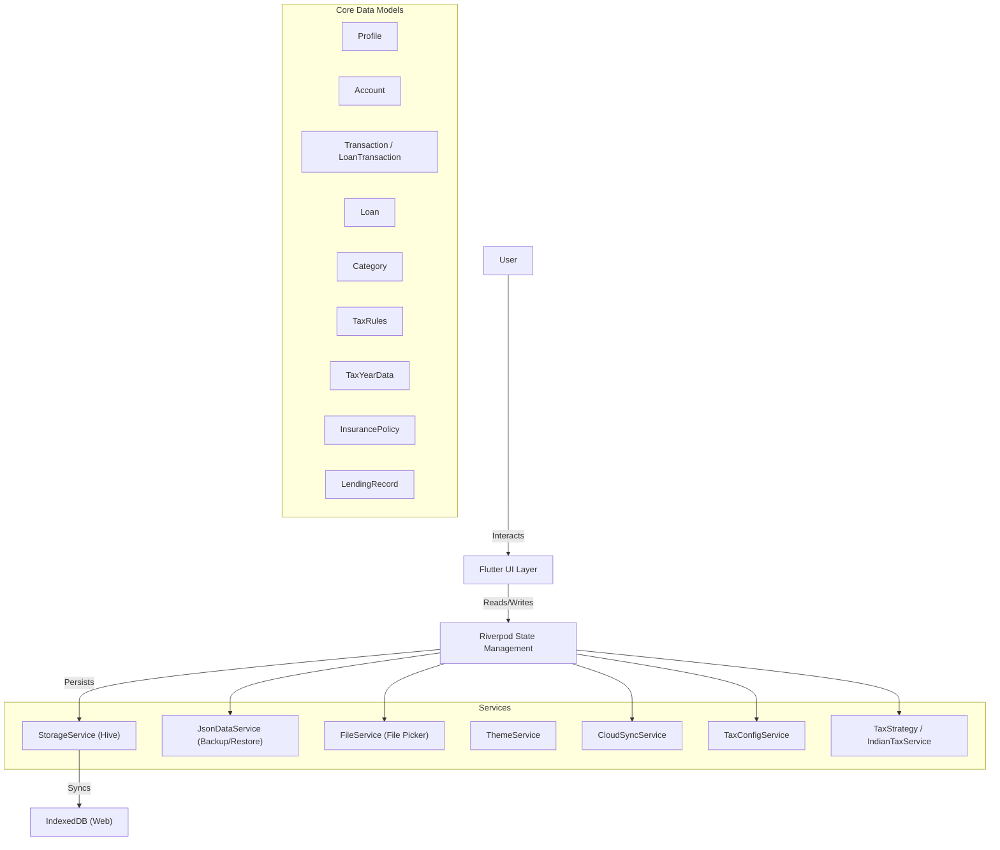

# Samriddhi Flow - Project Documentation

## 1. Project Overview
**Samriddhi Flow** is a premium personal finance and smart budgeting PWA designed for the Indian market (and global applicability). It emphasizes aesthetic excellence ("wow" factor), data privacy (local-first), and comprehensive financial tracking.

**Current Version:** v4.2.0

## 2. Architecture

### High-Level Architecture
Samriddhi Flow follows a **Local-First, Offline-Capable PWA** architecture.

### Key Components

*   **State Management:** `flutter_riverpod` used for reactive state, dependency injection, and business logic separation.
*   **Storage:** `hive_ce` (Community Edition) for fast, key-value storage. Adapters generated via `build_runner`.
*   **UI Framework:** Flutter Web (WASM-ready).
*   **Tax Engine:** `IndianTaxService` (implementing `TaxStrategy`) provides salary breakdown, TDS estimation, and multi-year tax liability calculation. `TaxConfigService` manages slab rules and configuration persistence.
*   **Lending Logic:** `LendingNotifier` manages the state of peer-to-peer debt, providing real-time aggregation of total lent and borrowed amounts.
*   **Design System:** Custom "Premium" aesthetic using gradients, glassmorphism, and smooth animations.

## 3. Data Flow & Features

### A. Accounts & Credit Cards
*   **Types:** Savings, Credit Card, Wallet.
*   **Credit Logic:**
    *   Tracks `Credit Limit`, `Billing Cycle`, `Due Date`.
    *   **Auto-Rollover:** Centrally triggered via `accountsProvider` on app launch. Detects billing cycle completion across all profiles.
    *   **Inclusive Billing:** Transactions on the billing day (e.g., the 28th) are treated as "Billed," while the new cycle starts on the 29th.
    *   **Unbilled Usage:** Calculated dynamically based on transactions strictly after the current cycle start.
    *   **Aggregated View:** Dashboard shows Total Credit Limit, Total Usage, and Utilization % across all cards.

### B. Transactions
*   **Types:** Income, Expense, Transfer.
*   **Logic:**
    *   `ImpactCalculator` determines how a transaction affects Account/Loan balances.
    *   **Recurring:** Supports recurring patterns (Daily, Monthly, etc) with holiday-aware adjustments.
    *   **Loans:** EMI payments are transactions linked to Loan entities.

### C. Backup & Restore (JSON/ZIP)
*   **Engine:** `archive` package & `json` encoding.
*   **Logic:**
    *   **Snapshots:** Generates a ZIP package containing separate JSON files for each data entity (Accounts, Transactions, Loans, etc.).
    *   **Full Restore:** Restoration involves a full wipe and replace cycle to ensure consistent data state across platforms.
    *   **Sanitization:** Automatically cleans non-finite numbers during the export process.

### D. Cloud Sync & Data Partitioning
*   **Mechanism:** Encrypted Partitioned Snapshot Synchronization.
*   **Backend:** Firebase Firestore (NoSQL).
*   **Partitioning Strategy:** 
    *   **Transactions:** Partitioned into monthly buckets (e.g., `2025-02`) under `transactions_v2` to avoid Firestore document size limits.
    *   **Tax Data:** Partitioned by year under `tax_data_v2`.
    *   **Loans:** Each loan is stored as a separate encrypted entry keyed by `loanId` under `loans_v2`.
    *   **Atomic Sync:** All partitioned data is uploaded in a single logical sync event with a `sync_format_version` tracking.
*   **Restore:** Fetches all partitions, decrypts, and repopulates the local Hive database.

### E. App Stability & Privacy
*   **App Lock:** Supports PIN protection with a 1-minute grace period and "Forgot PIN" recovery via Firebase re-authentication.
*   **Layout Safety:** UI components are designed with `LayoutBuilder` and `SingleChildScrollView` to prevent overflow errors on various device sizes and orientations.

### F. Loan Logic & Part Payments
*   **Interest Calculation:** Uses **Daily Reducing Balance** method. Interest is calculated exactly for the number of days between payments.
*   **Part Payment (Prepayment):**
    *   **Logic:** When a part payment is made, it is immediately deducted from the `Remaining Principal`.
    *   **Option 1: Reduce Tenure:** EMI remains the same; loan pays off faster.
    *   **Option 2: Reduce EMI:** Tenure remains the same; EMI is recalculated.
*   **Reminders & Determinism:** Uses the `clock` package for time-sensing across `RemindersScreen` and `pendingRemindersProvider` to ensure deterministic behavior and testability (avoiding 1st-of-month edge cases).
*   **Impact:** EMI/Prepayment transactions are linked to user accounts to maintain synchronized balances.

### G. Tax Engine & Precision
*   **Precision Guard:** Uses `1.0e15` as a finite substitute for `double.infinity` in Tax Slabs to prevent precision loss in Hive (JavaScript `Number.MAX_SAFE_INTEGER` limitation).
*   **Custom Exemptions (Head-Specific):** Supports dynamic deductions across all income heads (**Salary, House Property, Business, Other, Gift, Agriculture**). Rules can be fixed or percentage-based.
*   **Salary Structure & Allowances:**
    *   **Frequency-Aware Components:** Independent components (Bonuses, LTA, Deductions) respect their defined payout frequencies (Monthly, Quarterly, Trimester, Half-Yearly, Annually, Custom).
    *   **Custom Allowances:** Fully editable within the salary structure. Supports fixed annual amounts or month-specific partial payouts.
*   **Tax Dashboard Accessibility:** Primary actions (Edit Details, Sync, Tax Config) are positioned prominently below the year selector for better one-hand usability.
*   **Special Income Handling:**
    *   **Agriculture:** Supports partial integration logic with custom exemptions reducing the agri-base used for tax rate determination.
    *   **Gifts:** Aggregates non-exempt gifts and applies head-specific custom exemptions after the threshold check.

### H. Lending & Borrowing
*   **Tracking:** Manages money lent to or borrowed from individuals.
*   **Status:** Records can be marked as `Closed` with a specific date once settled.
*   **Aggregated View:** Provided via `totalLentProvider` and `totalBorrowedProvider` for effective debt management.
*   **Profile Scoping:** Automatically filtered by the active profile.

## 5. Build Instructions
Run: `build_pwa.bat`
*   **Note:** This command ensures that web resources are bundled locally for full offline capability.

## 6. Testing
Execute: `test_pwa.bat`

---
*Documentation synchronized with project state on 2026-03-01.*
